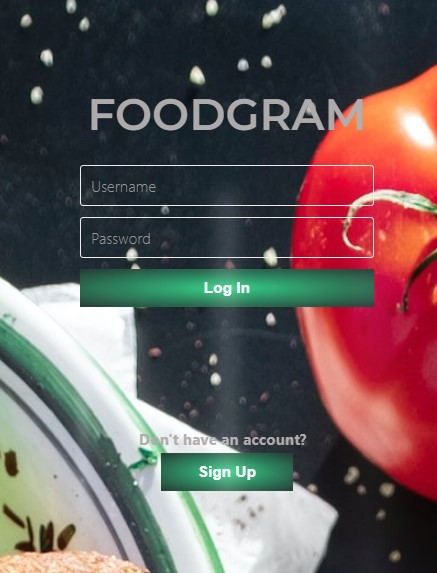
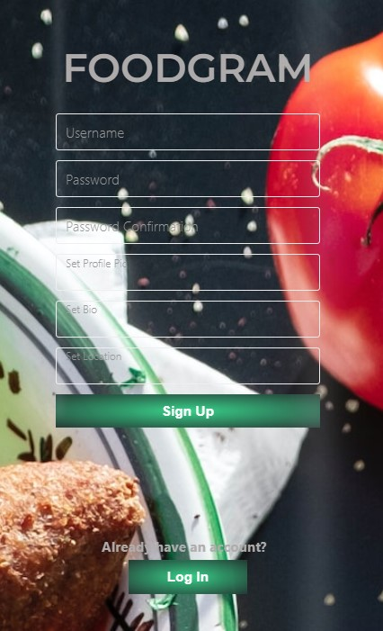

Welcome to FoodGram!! Your food based social media app!

--------------------------------------------------------------------------------

Table of Contents

    -General Info / Introduction

    -Technologies

    -Setup

    -Status

-----------------------------------------------------------------------

General Info / Introduction

With this app, the User will be able to sign up or login with their credentials. The User will be able to start posting immediately, have caption under their post as well as have comments as well. The User will be able to edit their own posts and comments if need be. Other users can comment and like other posts. Users will be able to see their own profile info and picture they uploaded. Users will be able to explore all other posts other than their own. 

 

---------------------------------------------------------

Technologies

    -React JS

    -Ruby on Rails

    -SASS

    -React router

    -React Icons

---------------------------------------------------------

Setup

To start, please run the following commands in your terminal:

    bundle install

    npm install --prefix client
     
    sudo service postgresql start

    rails s

Then open another terminal and run

    npm start --prefix client

Sign Up and enjoy!
     

---------------------------------------------------------

Status

COMPLETE

